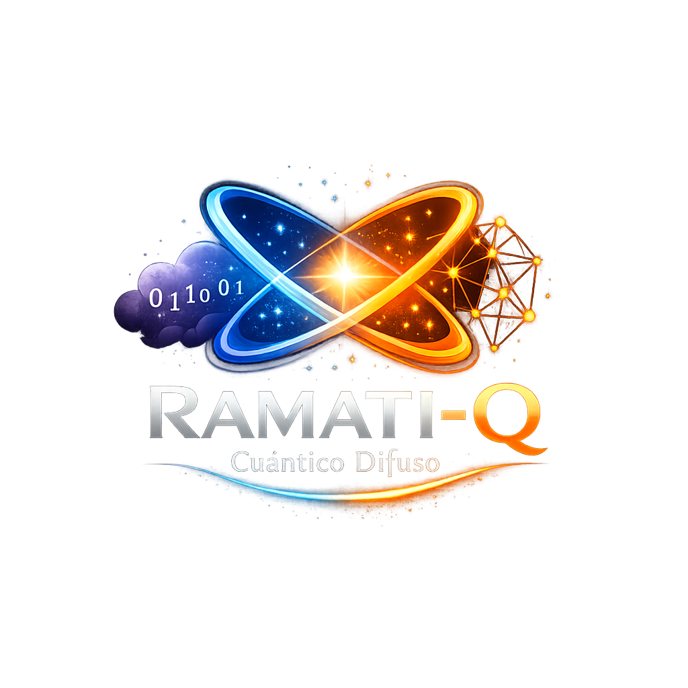

  

# RAMATI-Q

## Kernel Cognitivo Cuántico Difuso

**Estado actual:** Fase 1.5 Certificada y Cerrada

---

## Descripción

Ramati-Q es una plataforma de computación cognitiva y un lenguaje de programación diseñado para inteligencia artificial autónoma, robótica avanzada y sistemas ciberfísicos.

Su arquitectura combina:

- Lógica Difusa
- Memoria Contextual
- Navegación Autónoma
- Inferencia Cognitiva
- Persistencia de Estado
- Simulación de Hardware

---

## Estado del Proyecto

### Fase 1.0 ✅
Núcleo Fundacional

### Fase 1.2 ✅
Conciencia del Entorno

### Fase 1.5 ✅
Piloto Autónomo Certificado

### Fase 2.0 🚧
Sistema Cognitivo de Planificación

---

## Tecnologías

- Rust
- Cargo
- Simulación Cognitiva
- Arquitectura Modular

---

## Licencia

MIT License

---

Proyecto Ramati-Q © 2025-2026
